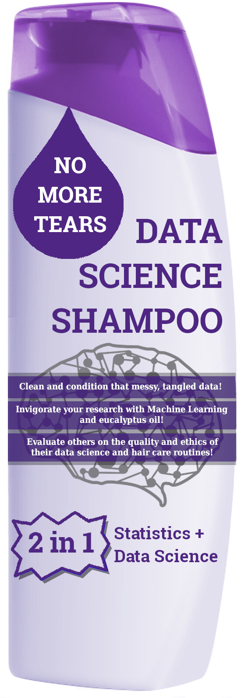

# Data Science Without Tears

The new year brings new opportunities for learning and professional development.
 
Western is offering a six-week bootcamp for faculty members called “Data Science Without Tears” - part of ongoing efforts to help build data acumen across campus.
 
The course takes only eight hours per week over six weeks and will cover the basics of data science. The course includes practical, hands-on exercises in Python notebooks, which are essential tools for data science work that can be accessed through your browser with no setup needed!
 
The course is designed to be accessible and not intimidating for those new to data science. No tears here!
 
The bootcamp will help you:
 
- Understand how to scale your research using simple data science tools and techniques
- Automate your data collection and processing in a re-producible workflow
- Summarize and visualize your research
- Understand common machine learning models and how they may apply to your own research
 
Are you ready to take your research to the next level with a better understanding of data science?

The first session will run for six weeks and begins **February 22nd**.

To register, sign up via the following form: [Registration not yet open]
