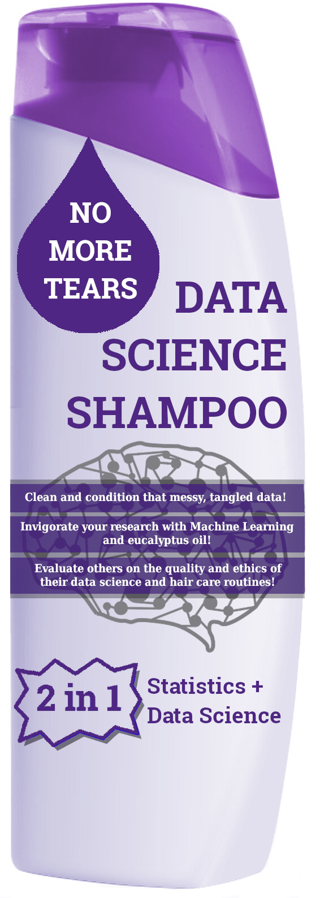

# Data Science Without Tears

The new year brings new opportunities for learning and professional development.
 
Western is offering a six-week bootcamp for faculty members called “Data Science Without Tears” - part of ongoing efforts to help build data acumen across campus.
 
The free course takes only eight hours per week over six weeks and will cover the basics of data science. The course includes practical, hands-on exercises in Python notebooks, which are essential tools for data science work that can be accessed through your browser with no setup needed!
 
The course is designed to be accessible and not intimidating for those new to data science. No tears here!
 
The bootcamp will help you:
 
- Understand how to scale your research using simple data science tools and techniques
- Automate your data collection and processing in a re-producible workflow
- Summarize and visualize your research
- Understand common machine learning models and how they may apply to your own research
 
Are you ready to take your research to the next level with a better understanding of data science?

See [here](https://www.uwo.ca/datastrategy/data-bootcamp/) for the official descripton.

Register [here](https://docs.google.com/forms/d/e/1FAIpQLScfUBwBpXGflg9IQQBhqz8qGsz1Jmbj1gs6sCnas2Z68OHXxA/viewform)!

## Learning Outcomes

Participants will:

- be empowered by their understanding of the general breadth of data science and its applications, advantages, and limitations
- acquire technical skills regarding data science, such as how to acquire data from a variety of sources, how to use Python to organize and analyze data, and how to create basic illustrations.
- be prepared to further their knowledge in the techniques relevant to their own research
- be able to evaluate the real-world data, analysis, and visualizations that they encounter in scholarly and mainstream contexts
- recognize social and ethical implications of data science, including privacy concerns and potential biases, in a broad variety of contexts.
work together with a broad community of interdisciplinary scholars to discuss data science.

## Session Schedule

1. **Introduction to Data Science **
    - A brief overview of what data science is and the models that it uses.
    - Examples of data science from real life.
    
2. **Data Principles and Practices: Processing, Cleaning, Visualizing**
    - Where does data come from? Where does data go? Where does data come from, Cotton Eye'd Joe?
    - The unglorious part of data science: checking for typos in your data :cold_sweat:.
    - :snake: A basic introduction to visualization using `Matplotlib` :bar_chart: and data cleaning using `pandas` :panda_face:.
3. **Linear Regression**
    - Linear models are explained.
    - Criteri for model selections are discussed.
    - :snake: A basic introduction to modelling with `sklearn` :microscope:.
4. **Machine Learning Algorithms**
    - Logistic regression is explained
    - Decision trees, random forests, and gradient decision trees are discussed. 
    - :snake: More python example codes related to logistic regression applications.
5. **More advanced Models**
    - Neural networks are discussed :crown:.
    - Natral language processing is explained.
    - :snake: Example of neural networks with `Keras`.
6. **Worked Examples, Conclusions, and Further Steps**
    - Data analyses the whole way through :crown:.

